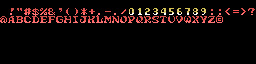
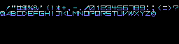

# MSX用フォントデータ  

## 概要

文字コードに対応したフォントパターンのデータです。  
パターンジェネレートテーブルはSCREEN 1、カラーテーブルはSCREEN 2に対応しています。  
以下の形式のファイルで格納しています。  

- 画像ファイル (`.png`)  
    サムネイルの画像ファイルです。  

- アセンブリソース (`.asm`)  
    パターンジェネレートテーブルとカラーテーブルの内容をベタで定義した形式です。  

- nMSXtilesのTilesデータ形式 (`.til`)  
    メニューバーのTiles - Load を選択し、各フォルダの`.til`ファイルをロードします。  
    nMSXtilesについては、[こちら](https://github.com/pipagerardo/nMSXtiles)を参照してください。  

## フォントデータ

以下のフォントデータを公開しています。  
 
📁[font001](font001)  
  
 
📁[font002](font002)  
  
 
📁[font003](font003)  
  

## リリースノート

- 2023/05/03
    - font001,font002,font003公開
