# MSX用スプライトパターンデータ  

## 概要

MSX1用スプライトパターンデータです。
以下の形式のファイルで格納しています。

- TinySpriteバックアップファイル (`.txt`)  
    [TinySprite](http://msx.jannone.org/tinysprite/tinysprite.html)でBackUp形式で出力したものです。Load Backupで貼り付けることで利用できます。  

- アセンブリソース (`.asm`)  
    [TnySprite](http://msx.jannone.org/tinysprite/tinysprite.html)でASM hexa形式で出力したものです。  

- BASICソース (`.bas`)  
    [TnySprite](http://msx.jannone.org/tinysprite/tinysprite.html)でData形式で出力したものです。  

TinySpriteの詳細は[こちら](https://github.com/jannone/msx-tinysprite)を参照ください。  

 

## スプライトパターンデータ

 

📁[adventurer](adventurer) (2plain)  

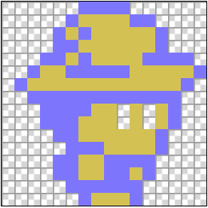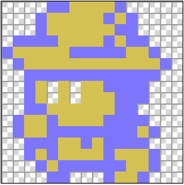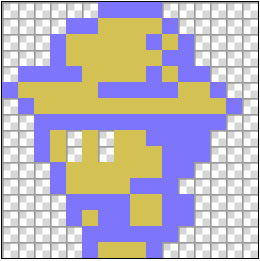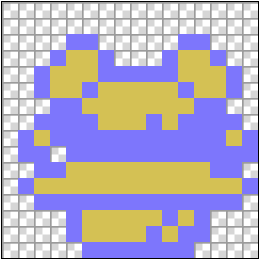  

 

📁[bat](bat) (1plain)  

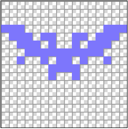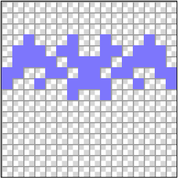  

 

📁[human](human) (2plain)  

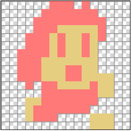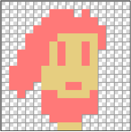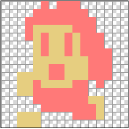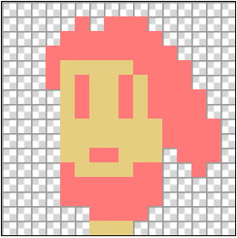  
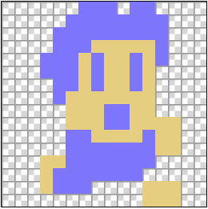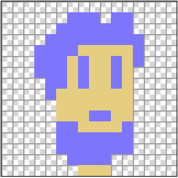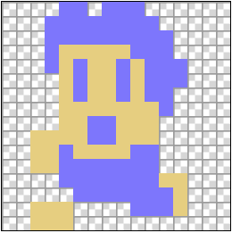  

 

📁[pig](pig) (2plain)  

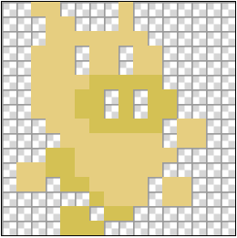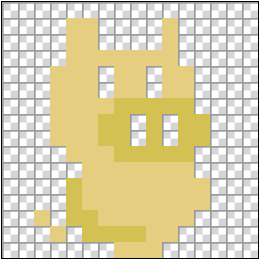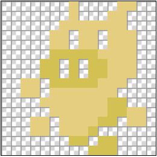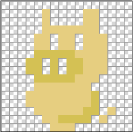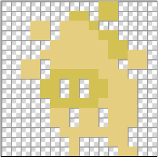  

 

📁[skeleton](skeleton) (1plain)  

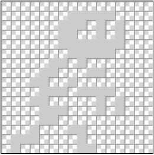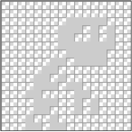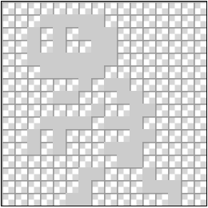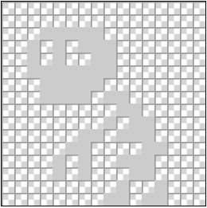  

 

📁[wolf](wolf) (2plain)  

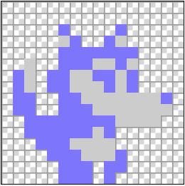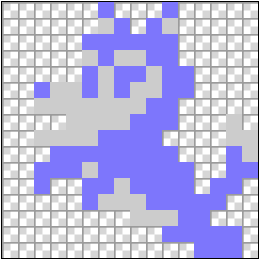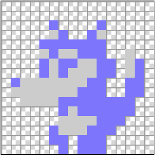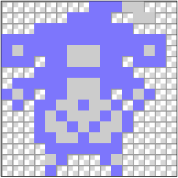  

 

## リリースノート

- 2023/05/15
    - 公開
